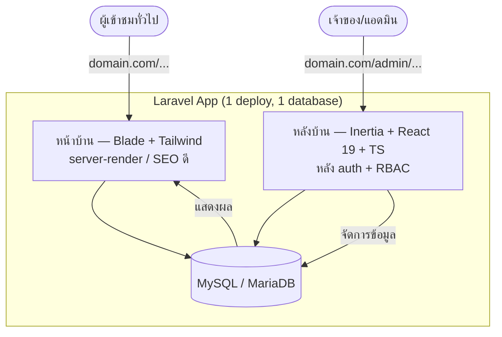

# Core App — Architecture

> สถาปัตยกรรมของ Core App (Laravel) — โครงตั้งต้น reusable สำหรับงาน freelance หน้าบ้าน-หลังบ้าน
> อ่าน `CLAUDE.md` ก่อนเพื่อเข้าใจ invariants ที่สถาปัตยกรรมนี้ยึด

---

## 1. ภาพรวม

**1 Laravel app, deploy เครื่องเดียว** — แยกหน้าบ้าน/หลังบ้านด้วย route + folder ไม่ใช่แยก project



- **หน้าบ้าน** (`/...`) = Blade → Google เห็น content, โหลดเร็ว, ไม่พึ่ง Node ตอน serve
- **หลังบ้าน** (`/admin/...`) = Inertia + React → admin จัดการข้อมูล (interactive ลื่น)
- **ข้อมูลไหลทางเดียว:** admin เพิ่ม/แก้ข้อมูล → หน้าบ้านดึงไปแสดง
- **single-tenant:** 1 ลูกค้า = 1 deploy = 1 database (ไม่มี tenant isolation)

---

## 2. โครงโฟลเดอร์

```
core/
├── app/Http/
│   ├── Controllers/
│   │   ├── Frontend/         หน้าบ้าน (return view Blade)
│   │   └── Admin/            หลังบ้าน (return Inertia::render)
│   ├── Requests/             Form Request (validation)
│   └── Middleware/
│       └── HandleInertiaRequests   ← rootView แยกตาม route
├── app/Models/               Eloquent models (+ SoftDeletes สำหรับ master data)
├── routes/
│   ├── web.php               หน้าบ้าน (public)
│   └── admin.php             หลังบ้าน (auth + permission)
├── resources/
│   ├── views/                Blade (หน้าบ้าน) + root view (app.blade.php, admin.blade.php)
│   ├── js/pages/admin/       React pages (หลังบ้าน)
│   └── css/
├── database/
│   ├── migrations/
│   ├── factories/  seeders/
├── tests/                    Feature + Unit
└── docs/
```

---

## 3. การแยก Blade / Inertia ใน app เดียว

หัวใจ: Inertia ใช้ **root view ต่างกันตาม route** — admin ใช้ React, หน้าบ้านเป็น Blade ปกติ (ไม่ผ่าน Inertia)

```php
// app/Http/Middleware/HandleInertiaRequests.php
public function rootView(Request $request): string
{
    return $request->routeIs('admin.*') ? 'admin' : 'app';
}
```

- หน้าบ้าน controller: `return view('frontend.home', [...])` — Blade ล้วน
- หลังบ้าน controller: `return Inertia::render('admin/Dashboard', [...])` — React
- asset แยก build ได้ (`resources/js/app.tsx` สำหรับ admin); หน้าบ้านใช้ Tailwind/Blade
- การข้ามจากหน้าบ้านไป `/admin` ใช้ link ปกติ (ไม่ใช่ Inertia visit)

> ดู ADR-0001 สำหรับเหตุผลที่เลือก Blade หน้าบ้าน + Inertia หลังบ้าน

---

## 4. Layer / ความรับผิดชอบ (Laravel convention)

```
Route → Middleware (auth, permission) → Controller → Form Request (validate)
      → Action/Service (logic) → Model (Eloquent) → DB
Controller → view() [Blade]  หรือ  Inertia::render() [React]
```

- **Controller บาง** — รับ request, เรียก logic, คืน response
- **logic ที่ซับซ้อน** → Action/Service class (ไม่ยัดใน controller)
- **ไม่มี business invariant ระดับ DB** แบบ SaaS (ไม่มี trigger/RLS) — กฎอยู่ที่ app layer
- **RBAC** ผ่าน middleware + policy (spatie/laravel-permission)

---

## 5. ของที่ core v0.1 มี (foundation ใช้ทุกงาน)

| ส่วน | รายละเอียด |
|---|---|
| Auth | login/logout/register/reset (จาก Laravel starter kit) |
| RBAC | role + permission (spatie), middleware กัน `/admin` |
| Admin CRUD | pattern + table (filter/paginate/sort) + form (validation) |
| Media | file/image upload (admin เพิ่ม → หน้าบ้านแสดง) |
| Settings | ค่า config ระบบที่แก้ผ่าน admin |
| Audit | log action สำคัญ (ใครทำอะไรเมื่อไหร่) |
| Frontend baseline | layout Blade + SEO meta + sitemap |

> ของที่ **ไม่อยู่** ใน core (ตาม YAGNI): payment, multi-language, realtime, queue worker, API สำหรับ mobile — เพิ่มเมื่อเจองานจริงที่ต้องใช้ (ดู roadmap phase 2-3)

---

## 6. Database

- **MySQL/MariaDB** (default) ผ่าน Eloquent — DB-agnostic
- **ห้าม** feature เฉพาะ DB (JSON function ลึก, generated column เฉพาะตัว) — ดู invariant 2
- master data → `SoftDeletes` (`deleted_at`); ข้อมูลชั่วคราว → hard delete
- migration เป็น Laravel migration; ไม่แก้ไฟล์ที่ deploy แล้ว สร้างใหม่

---

## 7. Dev / Deploy

| | Dev | Deploy (ลูกค้า) |
|---|---|---|
| Environment | Laravel Sail (Docker) | PHP hosting ปกติ |
| DB | MariaDB/MySQL ใน Sail | MySQL/MariaDB ของ cPanel/VPS |
| Asset | `npm run dev` / `build` | อัป `public/build` (ลูกค้าไม่ต้องมี Node) |
| Queue/Cache | database/file driver | database/file driver (cPanel รันได้) |

ขั้นตอน deploy + backup ละเอียด → `docs/architecture/infrastructure.md` (เขียนโดย infra-architect)

---

## 8. หลักการ 1 บรรทัด

> Core เล็ก เบา deploy ได้ทุกที่ — ใส่เฉพาะของที่ใช้ทุกงาน ที่เหลือถอดจากงานจริงเข้ามาเมื่อพิสูจน์ว่าซ้ำ
